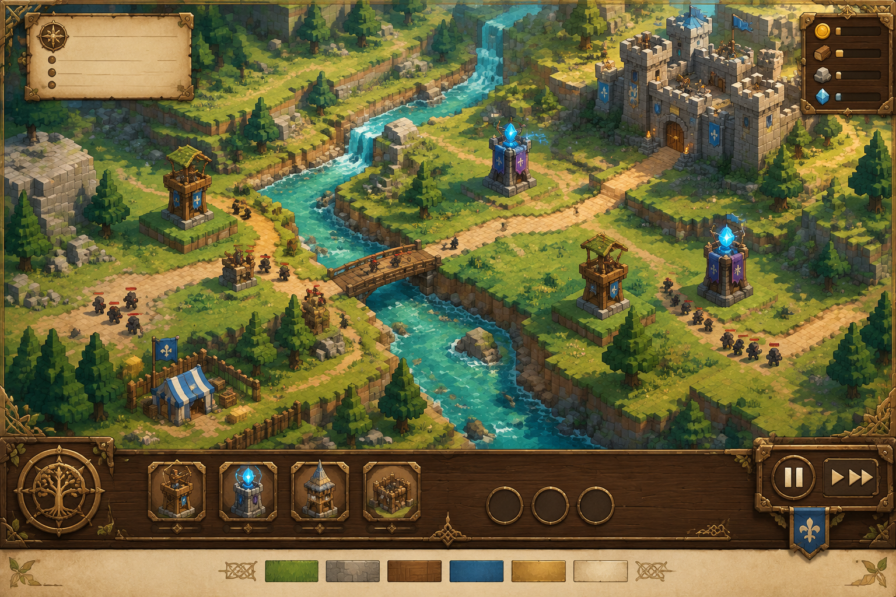
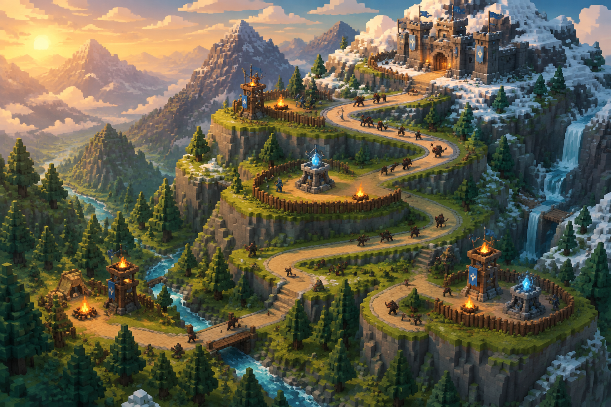
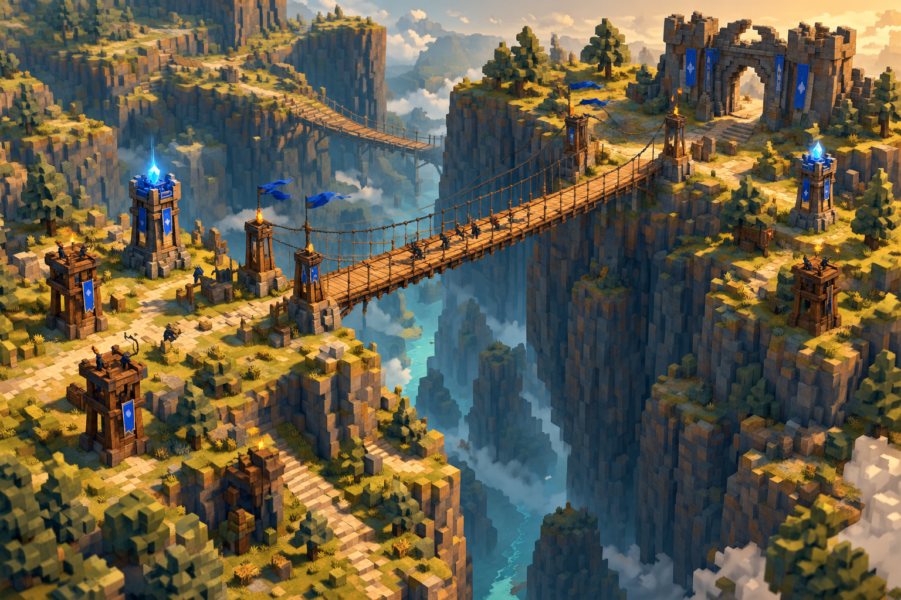
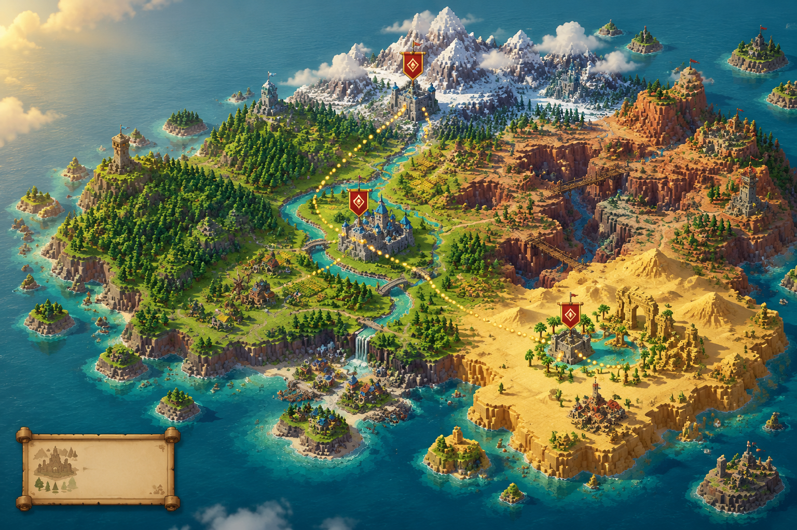
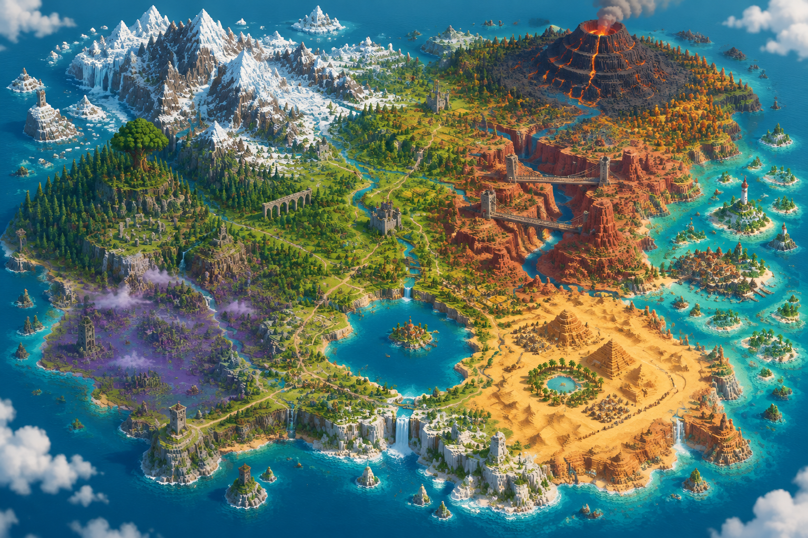

# 暮河守望 · 美术方向（2026-09-26）

这是一张生成的概念参考图，不是实际游戏截图。通过用户配置的 XEM Image API、gpt-image-2.5 生成，尺寸为 1536 × 1024。原始提示词保存在 [ui-reference-prompt.txt](ui-reference-prompt.txt)。

## 地图概念图

霜脊高地的提示词保存在 [mountain-map-prompt.txt](mountain-map-prompt.txt)，重点是盘山古道、阶梯平台、雪峰和高差路线。

风裂悬桥的提示词保存在 [canyon-map-prompt.txt](canyon-map-prompt.txt)，重点是双吊桥、深谷、桥头防御塔和替代路线。

## 已应用到游戏

- HUD 使用深橡木、黄铜铆钉、羊皮纸和金色选中条；保留中文文字、快捷键与价格。
- 箭塔、法师塔、兵营、石墙的按钮及选中面板使用参考图裁出的本地插画；源坐标见 [portrait-crops.json](portrait-crops.json)，运行素材在 public/art/ui/。
- 实际地块使用苔藓绿、青蓝河水与暖石色；补充河岸浅色水纹、贴地道路碎石和建筑旗徽。
- 3D 场景继续使用可交互的 Three.js 体素几何；参考图中的瀑布、建筑形状与场景布局并未完整复刻。

## 验收边界

参考图和裁切素材已检查。类型检查、生产构建与既有自动测试用于检查代码回归；实际 HUD 排版、光照和移动端画面仍需连接浏览器后验收。浏览器连接缺少认证时，不从 macOS Seatbelt 沙箱启动 Chrome 或 Playwright 代替验证。

## 世界地图选关

通过 XEM Image API / gpt-image-2.5 生成，尺寸为 1536 × 1024；提示词见 [campaign-map-prompt.txt](campaign-map-prompt.txt)。参考图用于大陆构图、生态区域和关卡旗帜的视觉方向。运行场景使用实际 Three.js 体素几何，包括雪山、河流、森林、沙漠、海岸与聚落，不使用概念图充当交互地图。

## 英雄 · 艾莉娅

新增白银轻甲精灵游侠的站姿立绘、拉弓海报与体素三视图。最终造型、源图、提示词与实现说明见 [英雄美术档案](heroes/README.md)。英雄殿堂已提供按关卡保存选择、四种外观展示和可旋转的体素模型；英雄战斗逻辑尚未接入。

## 更大大陆参考图

通过 XEM Image API / gpt-image-2.5 生成，提示词见 [greater-continent-prompt.txt](greater-continent-prompt.txt)。它确定十二片疆域的相对构图与地标：西北雪山峡湾、中央河谷与镜湖、东部断崖、东北火山、东南沙海、南部海崖和东侧群岛。运行时使用程序化体素几何复刻这些地形关系。
